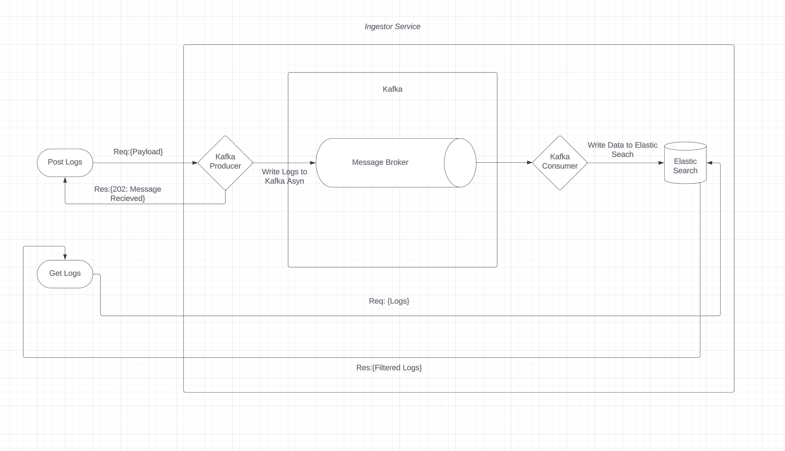
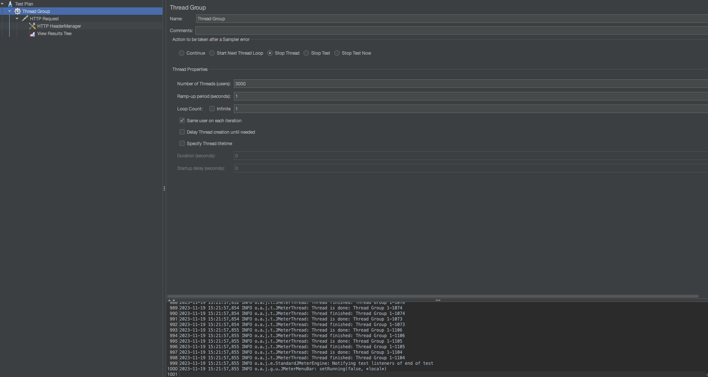
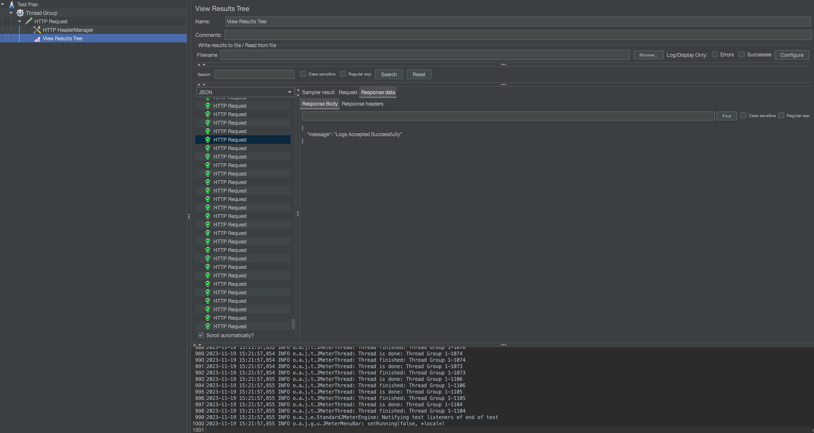

# Log Ingestor and Query Interface

## Tech Stack

**Server:** Node, Express, Apache Kafka

**DB**: Elastic Search

## Requirements
- Node.js (Preferred: LTS v14): For running the _Ingestor service_.
- Docker: For running the container for  .

## Set up
- Clone the repo
- CD into the project directory
- Run ```docker-compose up``` (Pulls and sets up kafka, zookeeper and elasticsearch)
- Install project dependencies: Run ```npm i```
- Start the nodemon server: ```npm run start```
- Congo!!! 🥳, You are good to go....
- Access the swagger UI at _http://localhost:3000/api-docs/#/_

## HLD
- We have an async push based log _Ingestor service_
- The log producer will POST a log to the ```_ingestLog_``` (port: 3000) endpoint, a ```202``` accepted response will be provided.
- The _Ingestor service_ uses a Kafka message queue to ensure high availability and low ingestion latency.
- The logs are then consumed and in memory batches (size configurable) are made.
- These logs batches are then bulk inserted into an elastic search instance, which is used for quick retrievals.
- The ```_getLogs_``` endpoint of the _Ingestor service_ is used to query the logs.
- The ```_getLogs_``` endpoint is a accepts a POST request that supports intuitive filter based querying. (Ref: Swagger API Docs). 




## API Reference

#### Query Logs

```http
POST /getLogs
```

| Request Body | Type     | Description                |
| :-------- | :------- | :------------------------- |
| `serach_query` | `JSON obj` | **Required**. Your search query |

    POST getLogs:-  (All fields are optional)
        {
            "level": "string",
            "message": "string",
            "resourceId": "string",
            "timestamp": "DateTimeStamp",
            "traceId": "string",
            "spanId": "string",
            "commit": "string",
            "metadata": {
                "parentResourceId": "string"
            }
        }
                            
        Valid response: 
        200 
        {
            "results": [{
                "_id": "nGh14osBahF5gcFvQ2X2",
                "_source": {
                    "level": "string",
                    "message": "string",
                    "resourceId": "string",
                    "timestamp": "2023-11-18T12:43:36.377Z",
                    "traceId": "string",
                    "spanId": "string",
                    "commit": "string",
                    "metadata": {
                    "parentResourceId": "string"
                    }
                }
            }, ...
        ]}

#### Create log

```http
  POST /ingestLogs
```

| Request Body | Type     | Description                       |
| :-------- | :------- | :-------------------------------- |
| `log`      | `JSON obj` | **Required**. Log to insert to be queried |


    POST ingestLogs:-  (All fields are mandatory)
    {
        "level": "string",
        "message": "string",
        "resourceId": "string",
        "timestamp": "DateTimeStamp",
        "traceId": "string",
        "spanId": "string",
        "commit": "string",
        "metadata": {
            "parentResourceId": "string"
        }
    }
    
    Valid responses: 
        202 Log entry created successfully
        400 Bad request

                
    
---------------------------------------------------------------------------

## Features:
-  Highly scalable and available log ingestion endpoint.
-  Asynchronous log ingestion.
-  Full-text search across logs.
-  Filters based on:
    - level
    - message
    - resourceId
    - timestamp
    - traceId
    - spanId
    - commit
    - metadata.parentResourceId
- Multiple filters support.
- Near real-time log ingestion and searching capabilities.
- Regexp search using elastic search ```_search``` endpoint.


## Load Testing
The JMeter test configuration simulates 3000 users with a swift ramp-up of 1 second, performs a single iteration with all users, maintains consistency by using the same users on each iteration, and creates threads without delay until needed.


 

The test executed 3000 HTTP requests with an average response time of 142 milliseconds, a throughput of 165.72 requests per second, and no errors. The data transfer rates for received and sent data were 45.48 KB/sec and 69.10 KB/sec, respectively, with an average response size of 281 bytes.

| Label         | # Samples | Average | Min | Max | Std. Dev. | Error % | Throughput | Received KB/sec | Sent KB/sec | Avg. Bytes |
|---------------|-----------|---------|-----|-----|-----------|---------|------------|------------------|-------------|------------|
| HTTP Request  | 3000      | 142     | 0   | 421 | 95.17     | 0.000%  | 165.71839  | 45.48            | 69.10       | 281.0      |
| TOTAL         | 3000      | 142     | 0   | 421 | 95.17     | 0.000%  | 165.71839  | 45.48            | 69.10       | 281.0      |



## Testing Machine Configuration
- Chip: Apple M1 pro
- Memory: 32 gb

